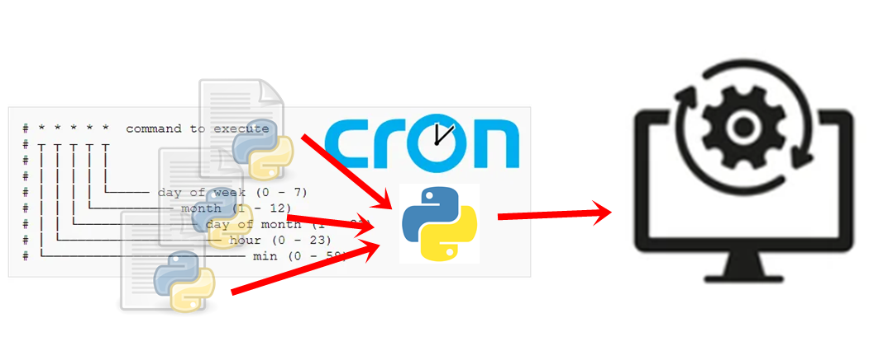

<h1 align="center"> FelipedelosH </h1>
<br>
<h4>CronTask By LOko v1.0</h4>


:construction: IN CONTRUCTION :construction:
<br><br>
This program is cretate to execute Task in time lapses using cron expresións. you only need put you script in the folder Task. and remember put the cron expresión in the first line of script. for example if you execute a script every monday at 15 O'clock:<br>
```
#expresion_cron=0 15 * * 1
```

## :hammer:Funtions:

- `Function 1`: Automatic load all scripts.py files in folder Task<br>
- `Function 2`: Automatic register and execuion to script file in task folder<br>
- `Function 3`: LOG system for every event in execute task folder<br>


## :play_or_pause_button:How to execute a project

Install all requirements with the command: pip install -r requirements.txt<br>
insert your script.py in folder: Task/<br>
Your script must have a cron expresión var in the first line<br>
Register your script in main.py<br>
RUN main.py<br>


## About the time to execute scripts

It´s based in library "Schelude" of python https://schedule.readthedocs.io/
<br>
It´s based in library "croniter" of python https://github.com/kiorky/croniter 
<br>
you only need to put a label in first part of script (example of basic script):

```
#expresion_cron=* * * * *
print("every minute this task is execute...")
```

Save it "script.py" and put it in folder "Task"

## :hammer_and_wrench:Tech.

- Python
- Schelude
- Croniter


## Architecture

```
PROJECT
    Task
        files.py
    main.py
    log.log
    requirements.txt
```

## :warning:Warning.

- every python file in the folder task be single archive, NOT support another subclass files.

## Autor

| [<br><sub>Andrés Felipe Hernánez</sub>](https://github.com/felipedelosh)|
| :---: |